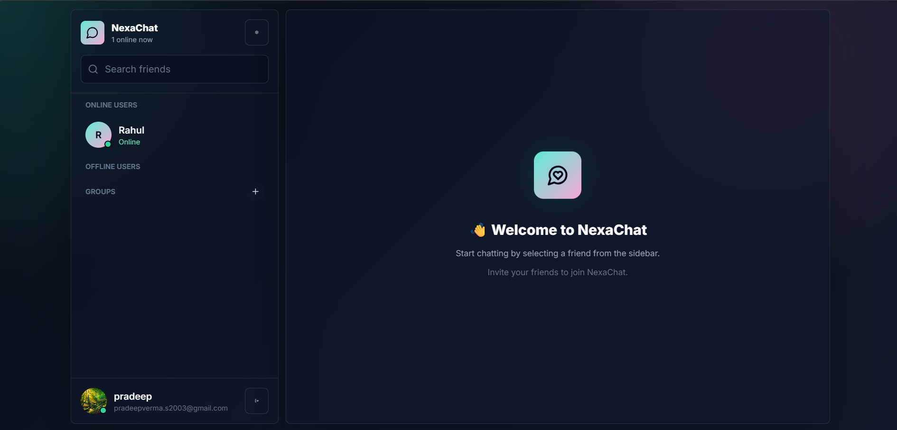
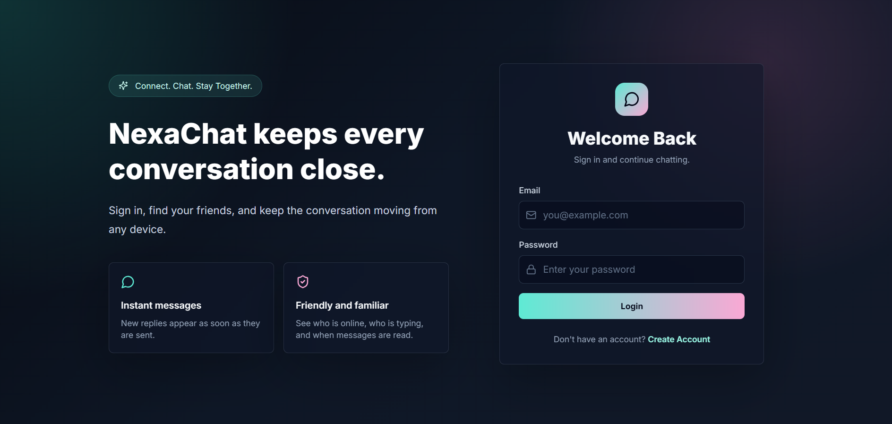

# 💬 NexaChat

<p align="center">
  
</p>

<h1 align="center">🚀 NexaChat</h1>

<p align="center">
A modern full-stack real-time messaging platform built using the <b>MERN Stack</b>, <b>Socket.IO</b>, and <b>WebRTC</b>.
</p>

<p align="center">

🌐 <b>Live Demo</b><br>
https://nexa-chat-eta.vercel.app

🔗 <b>Backend API</b><br>
https://nexachat-uhw2.onrender.com

</p>

<p align="center">


</p>

---

# 🌟 Overview

NexaChat is a production-style real-time chat application inspired by modern messaging platforms.

It supports instant messaging, voice & video calling, media sharing, authentication, online presence, typing indicators, groups, and much more.

The project demonstrates scalable MERN architecture, Socket.IO communication, WebRTC signaling, and cloud media storage.

---

# 🌍 Live Deployment

### 🚀 Frontend

https://nexa-chat-eta.vercel.app

### ⚙️ Backend API

https://nexachat-uhw2.onrender.com

> **Note**
>
> Backend is hosted on **Render Free Tier**.
>
> If inactive for some time, the first request may take **30–60 seconds** to wake up.

---

# ✨ Features

## 🔐 Authentication

* JWT Authentication
* Secure Login & Registration
* Password Hashing (bcrypt)
* Protected Routes
* Persistent Login
* Auto Authentication
* Secure Cookies
* Authorization Middleware

---

## 💬 Real-Time Messaging

* One-to-One Chat
* Instant Messaging
* Online / Offline Presence
* Typing Indicator
* Delivered Status
* Seen Status
* Edit Message
* Delete for Me
* Delete for Everyone
* Reply Messages
* Copy Messages
* Emoji Reactions
* Auto Scroll
* Unread Message Counter

---

## 📷 Media Sharing

* Image Upload
* Camera Capture
* File Upload
* Image Preview
* Full Screen Image Viewer
* Download Images
* Cloudinary Integration

---

## 🎤 Voice Features

* Voice Notes
* Voice Recording
* Audio Playback

---

## 📞 Voice & Video Calling

* WebRTC Video Calling
* Audio Calling
* Accept / Reject Calls
* Camera Toggle
* Microphone Toggle
* Live Call Status
* Incoming Call Screen
* Ring Tone
* End Call

---

## 👥 Groups

* Create Groups
* Group Chat
* Group Members
* Group Admin
* Group Messaging

---

## 📱 Mobile Friendly

* Responsive UI
* Mobile Layout
* Camera Support
* File Picker
* Touch Friendly
* Progressive Web App Ready

---

# 🛠 Tech Stack

| Frontend     | Backend    | Database      | Realtime         |
| ------------ | ---------- | ------------- | ---------------- |
| React.js     | Node.js    | MongoDB Atlas | Socket.IO        |
| Vite         | Express.js | Mongoose      | WebRTC           |
| Tailwind CSS | JWT        | Cloudinary    | Peer Connections |
| Zustand      | Multer     |               |                  |

---

# 📂 Project Structure

```text
NexaChat
│
├── backend
│   ├── src
│   │   ├── config
│   │   ├── controllers
│   │   ├── middleware
│   │   ├── models
│   │   ├── routes
│   │   ├── socket
│   │   ├── utils
│   │   └── server.js
│   │
│   ├── package.json
│   └── .env
│
├── frontend
│   ├── src
│   │   ├── api
│   │   ├── assets
│   │   ├── components
│   │   ├── hooks
│   │   ├── layouts
│   │   ├── pages
│   │   ├── routes
│   │   ├── store
│   │   ├── utils
│   │   └── App.jsx
│   │
│   ├── package.json
│   ├── vite.config.js
│   └── vercel.json
│
├── image
│   ├── Home.png
│   └── Loging.png
│
└── README.md
```

---

# 📸 Screenshots

## 🔑 Login Page

<p align="center">

</p>

---

## 💬 Chat Dashboard

<p align="center">

</p>

---

# 🚀 Installation

## Clone Repository

```bash
git clone https://github.com/PRADEEVERMA/NexaChat.git

cd NexaChat
```

---

# Backend Setup

```bash
cd backend

npm install
```

Create a **.env**

```env
PORT=5000

MONGODB_URI=YOUR_MONGODB_URI

JWT_SECRET=YOUR_SECRET

JWT_EXPIRES_IN=7d

CLIENT_URL=http://localhost:5173

COOKIE_DOMAIN=

CLOUDINARY_CLOUD_NAME=

CLOUDINARY_API_KEY=

CLOUDINARY_API_SECRET=
```

Run Backend

```bash
npm run dev
```

---

# Frontend Setup

```bash
cd frontend

npm install

npm run dev
```

---

# 🌍 Environment Variables

## Backend

```env
PORT

MONGODB_URI

JWT_SECRET

JWT_EXPIRES_IN

CLIENT_URL

COOKIE_DOMAIN

CLOUDINARY_CLOUD_NAME

CLOUDINARY_API_KEY

CLOUDINARY_API_SECRET
```

---

## Frontend

```env
VITE_API_URL=http://localhost:5000/api

VITE_SOCKET_URL=http://localhost:5000
```

Production

```env
VITE_API_URL=https://nexachat-uhw2.onrender.com/api

VITE_SOCKET_URL=https://nexachat-uhw2.onrender.com
```

---

# 🏗 Architecture

```text
React (Vite)
      │
Axios + Socket.IO Client
      │
──────── Internet ────────
      │
Node.js + Express
      │
Socket.IO
      │
MongoDB Atlas
      │
Cloudinary
```

---

# 🚧 Roadmap

* Push Notifications
* Group Video Calls
* Screen Sharing
* Stories / Status
* Progressive Web App
* Mobile Application
* End-to-End Encryption
* AI Chat Assistant
* Message Search
* Message Forwarding
* Chat Backup

---

# 👨‍💻 About the Developer

## Pradeep Verma

🎓 B.Tech Computer Science Engineering (2026)

💻 Full Stack MERN Developer

🚀 Passionate about Real-Time Applications, Backend Systems, MERN Stack, and Scalable Web Development.

### Connect

GitHub

https://github.com/PRADEEVERMA

LinkedIn

https://www.linkedin.com/in/YOUR-LINKEDIN

---

# ⭐ Support

If you found this project helpful,

⭐ Star this repository

🍴 Fork it

🛠️ Contribute to it

Every ⭐ motivates me to build more open-source projects.

---

# 📄 License

This project is licensed under the **MIT License**.

Feel free to use, modify, and contribute.

---

<p align="center">

Made with ❤️ using React, Node.js, Express, MongoDB, Socket.IO & WebRTC

<br><br>

<b>© 2026 Pradeep Verma</b>

</p>
